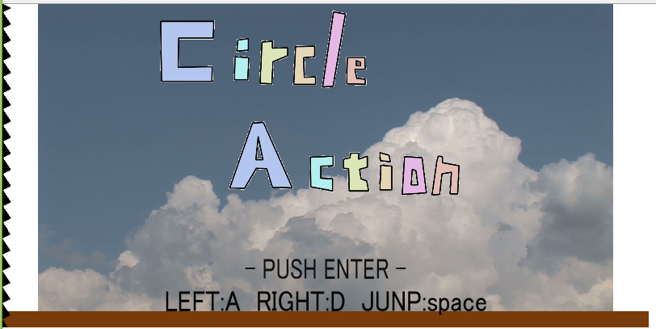
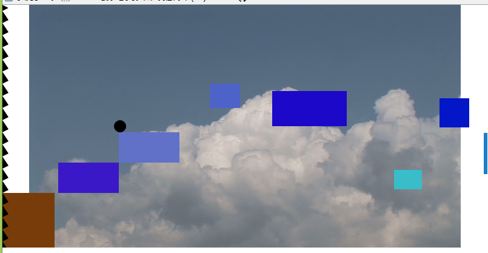

# 最終発表  
チーム：htmlTOT  
メンバー：田中　高松　大石

### HTML5の新機能とそのデモ  

<strong>canvasタグ </strong>  
HTML5で追加されたタグの中でcanvasタグに着目した。   
プラグイン等の外部ソフトを使用せず、htmlだけで画像などを描画することができる。   
canvasのいくつかの機能とjavascriptを使用してデモゲームを作成した。   

<strong>videoタグ </strong>  
従来の画像と同じようにURLを指定して動画を表示できる。   
属性を指定してオート再生、コントロールの追加などができる。 
デモゲームの背景として使用   

<strong>デモゲーム画面</strong>

__canvasメソッド一部__  
※ctxはcanvasを呼び出し、格納した変数  
<strong>－－－－－－線の描画－－－－－－－</strong>   
<table>
  <tr>
    <td>ctx.beginPath();</td>
    <td>描画を始める宣言</td>
  </tr>
  <tr>
    <td>ctx.moveTo(20, 20);</td>
    <td>線の開始点を設定(x座標20、y座標20の位置に設定)</td>
  </tr>  
   <tr>
    <td>ctx.lineTo(120, 20) </td>
    <td>線の終了点を設定(前回座標から今回座標まで線を引く)  </td>
  </tr>
  <tr>
    <td>ctx.closePath();</td>
    <td>書いた線を閉じる(これが宣言されるまで線を引き続ける)</td>
  </tr>
   <tr>
    <td>ctx.stroke();</td>
    <td>書いた図を線で描画する  </td>
  </tr>
  <tr>
    <td>ctx.fill();</td>
    <td>書いた図の内側を塗りつぶして描画する </td>
  </tr>
</table>

<strong>－－－－－－図の描画－－－－－－－</strong>
<table>
  <tr>
    <td>ctx.strokeRect(10,20,30,40);</td>
    <td>開始点x:10y:20、幅30、高さ40の四角形の枠を描く </td>
  </tr>  
   <tr>
    <td>ctx.fillRect(10,20,30,40);</td>
    <td>開始点x:10y:20、幅30、高さ40の塗りつぶされた四角形を描く  </td>
  </tr>
   <tr>
    <td>ctx.arc(10,20,5,0,Math.PI*2,true); </td>
    <td>座標x:10y:20を中心に半径5の円を描く。開始点は0、終了点はMath.PI\*2</td>
  </tr>
  <tr>
    <td>ctx.fillStyle = 'rgba(192, 80, 77, 0.7)';</td>
    <td>塗りつぶしの色を設定する(red:192,green:80,blue:77,透明度0.7)</td>
  </tr>
  <tr>
    <td>ctx.clearRect(10, 20, 30, 40);</td>
    <td>範囲内の描画を消去する </td>
  </tr>
</table>
<strong>－－－－－－テキストの描画－－－－－－－</strong>    
<table>
  <tr>
    <td>ctx.font = "26px 'ＭＳ Ｐゴシック'";</td>
    <td>フォントの設定</td>
  </tr>  
   <tr>
    <td>ctx.fillText("表示するテキスト",X座標 ,Y座標 ,幅);</td>
    <td>表示するテキストをX、Yの位置に指定幅(任意)で描画する</td>
  </tr>
   <tr>
    <td>ctx.strokeText("表示するテキスト",X座標 ,Y座標 ,幅); </td>
    <td>表示するテキストをX、Yの位置に指定幅(任意)で枠線のみ描画する</td>
  </tr>
</table>
<strong>－－－－－－画像の呼び出し－－－－－－－</strong>   
<table>
  <tr>
    <td>ctx.drawImage(img, X座標, Y座標, 幅, 高さ);</td>
    <td>画像URLをimgに指定して、座標を指定し呼び出す 
        ※事前にImageオブジェクトを生成する
  </tr>  
</table>

